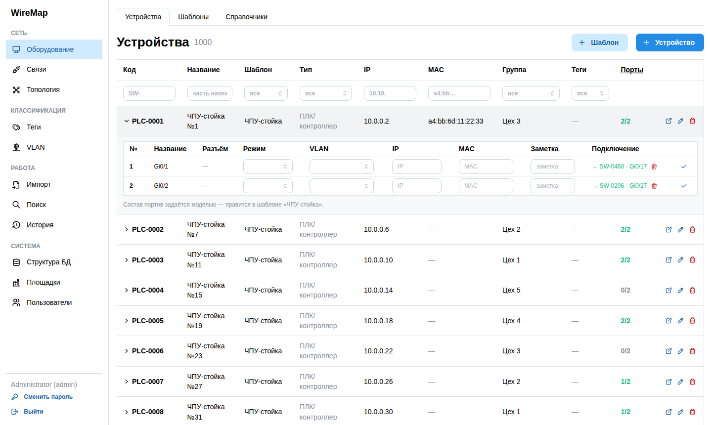
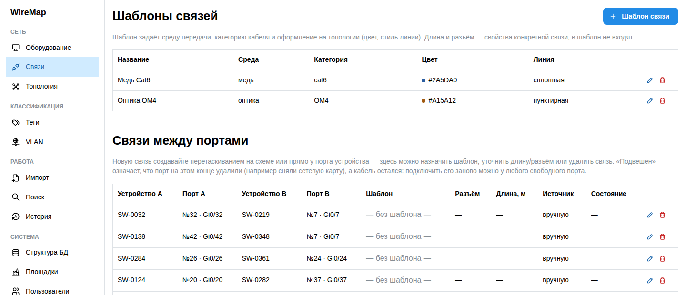
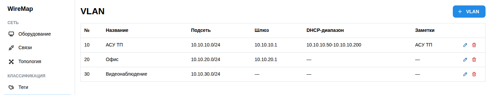

# WireMap

Документирование физической сети предприятия: спецификация оборудования,
порты, кабельные связи и схема связей между устройствами.

Кому: инженерам и админам, которые сейчас держат карту сети в Excel и в
голове. Вместо «какой станок висит на 14-м порту SW-0003» — запрос в системе.

## Скриншоты

| Спецификация оборудования | Связи между портами |
|---|---|
|  |  |



## Что умеет

- **Спецификация оборудования.** Шаблон модели (порты заводятся один раз)
  → устройства-экземпляры с автоматически сгенерированными кодами
  (`SW-0001`, `SRV-0002`). Список — таблица с отбором под каждым заголовком;
  раскрытая строка показывает порты. Шаблоны сгруппированы по типу техники,
  у каждого видно, сколько устройств этой модели заведено.
- **Разъёмы и модули.** У порта модели задан разъём (RJ45, SFP+, LC...).
  SFP и подобные — клетка: разъём появляется вместе с модулем, который
  выбирают у конкретной железки. Оба списка редактируются в «Справочниках».
- **Порты и связи.** Кабель документируется как связь двух портов. Статус
  порта (свободен/подключён) нигде не хранится — вычисляется по наличию
  связи, поэтому рассинхрона не бывает.
- **Схема связей.** Автоматическая раскладка по кабелям (ELK): ядро сети
  слева, за ним цеховые коммутаторы, за ними железки; группа раскладывается
  как рамка со своим содержимым, подгруппа — внутри неё. Перетаскивание
  узлов с сохранением позиции и привязкой к сетке: карточки встают серединами
  по её узлам, чтобы кабели между ними шли прямо, рамки групп — контуром и
  размером, а шаг сетки настраивается.
  Цвет и стиль линии по шаблону связи. Разводка
  кабеля выбирается в меню «Вид»: прямая линия, прямые углы в обход чужих
  карточек или «метро» с диагоналями; отдельно — начертание линии, вплоть до
  скруглённых углов, дуги и «мостиков» на пересечениях. Единственного
  правильного способа нет: на редкой схеме прямая читается короче, на плотной
  она идёт через чужие карточки, и обход становится нужнее краткости.
- **Группировка.** Вложенные теги (устройство может иметь несколько) и
  отдельно — группа на схеме (ровно одна на устройство).
- **Импорт из файла.** Список устройств из `.xlsx` или `.csv` попадает в
  промежуточную таблицу, а не сразу в спецификацию: строки переносятся по
  одной через обычное окно устройства с подставленными данными. Данные в
  файле могут быть неполными, лишние колонки уходят в заметки. Названия
  шаблонов, групп и тегов, которых ещё нет в справочниках, видны отдельным
  блоком над таблицей и заводятся оттуда же.
- **Выгрузка Siemens Automation Tool.** Тот же импорт принимает `.xml`,
  который выдаёт инструмент после сканирования сети PROFINET: станции с их
  адресами, моделями, артикулами, серийными номерами и составом стоек по
  слотам. Русские имена, записанные в сети как `xn--j1ajdcc3d`,
  возвращаются в читаемый вид.
- **Площадки.** Разные фабрики не пересекаются: устройства, кабели, теги,
  VLAN и группы принадлежат одной площадке, и кабель между площадками не
  запишется даже при ошибке в программе — это запрещено самой базой. Модели
  техники и пресеты кабелей общие. Площадка выбирается в шапке, доступ к ней
  раздаёт администратор.
- **VLAN, роли, журнал изменений.** Три роли: `admin`, `editor`, `viewer`.

## Запуск на своей машине

Нужен только [Docker](https://www.docker.com/products/docker-desktop/).

**Windows (PowerShell):**

```powershell
git clone https://github.com/Sined216/Net.git
cd Net
.\scripts\start.ps1
```

**Linux / macOS:**

```bash
git clone https://github.com/Sined216/Net.git
cd Net
./scripts/start.sh
```

Скрипт при первом запуске создаёт `.env` со случайным ключом подписи токенов
и случайными паролями, собирает образы и поднимает стек. Логин и пароль
администратора печатаются в конце и сохраняются в `.env`. Повторный запуск
существующий `.env` не трогает — пароли не меняются.

Когда всё поднимется:

| | |
|---|---|
| Интерфейс | http://localhost:8080 |
| Swagger UI | http://localhost:8000/docs |

Полезное рядом:

```bash
docker compose logs -f      # логи
docker compose down         # остановить
docker compose down -v      # остановить и удалить базу
```

### Если порты заняты

Поменяйте в `.env` и перезапустите:

```
WEB_PORT=9090
API_PORT=9000
```

### Не пускает по паролю

Сначала посмотрите `.env` — при первом запуске скрипт кладёт туда логин и
пароль администратора и больше их не меняет:

```
BOOTSTRAP_ADMIN_USERNAME=admin
BOOTSTRAP_ADMIN_PASSWORD=...
```

Учтите: эта пара действует только при **пустой** таблице пользователей. Если
пароль потом меняли в интерфейсе, в `.env` остался прежний, а действует
новый — правка `.env` ничего не изменит.

Что говорит сама программа:

| Сообщение | Что происходит |
|---|---|
| «Неверный логин или пароль» | пароль не тот — или учётную запись заблокировал администратор (заблокированному намеренно не подсказывают, что логин угадан) |
| «Слишком много неудачных попыток входа» | после пяти промахов подряд вход в эту учётную запись закрывается на паузу — минута, дальше вдвое дольше, максимум полчаса. Удачный вход счётчик обнуляет; насовсем не запирает никогда |

Посмотреть, что с учётными записями на самом деле:

```bash
docker compose exec backend python -m app.reset_password --list
```

```
логин  роль      состояние
admin  admin     пауза после 6 неудачных попыток, ещё 47 с
ivanov editor    вход открыт
```

Задать новый пароль (спросит и не покажет ввод; заодно снимет паузу):

```bash
docker compose exec backend python -m app.reset_password admin
```

Остальное — `--unlock` снимает только паузу, не трогая пароль; `--activate`
заодно включает отключённую учётную запись. Права здесь не проверяются и не
могут: у того, кто выполняет команды на сервере, доступ к базе и так полный.

**Базу ради забытого пароля пересоздавать не нужно** — `docker compose
down -v` сотрёт вместе с ней всю документацию сети.

### Резервные копии

Вся документация сети живёт в одном томе с базой, поэтому копии нужны с
первого дня.

```bash
./scripts/backup.sh                 # копия в backups/
./scripts/restore.sh                # развернуть последнюю копию
./scripts/restore.sh backups/wiremap-20260810-031500.sql.gz
```

Windows — `.\scripts\backup.ps1` и `.\scripts\restore.ps1` с теми же
возможностями.

Копия снимается с работающей базы, останавливать стек не нужно; хранятся
последние 14 (`--keep N`). Восстановление заменяет содержимое базы целиком,
поэтому спрашивает подтверждение и перед этим само снимает копию текущего
состояния.

В расписание — обычным cron:

```
15 3 * * *  /путь/до/Net/scripts/backup.sh >> /var/log/wiremap-backup.log 2>&1
```

Копии лежат рядом с проектом. Если диск один, унесите их на другую машину:
резервная копия на том же диске переживает ошибку человека, но не отказ
диска.

### Доступ с других машин в сети

Достаточно открыть `http://<ip-этой-машины>:8080` — интерфейс и API живут за
одним nginx, поэтому CORS не задействован и адрес API вводить не нужно.
Не забудьте разрешить порт в брандмауэре.

**По HTTP пароль и токен входа идут по сети открытым текстом.** Внутри
одного доверенного сегмента (один VLAN, один шкаф) это обычно приемлемый
риск — так и задуман образ по умолчанию. Если сеть больше не выглядит
доверенной (гостевой Wi-Fi в том же сегменте, доступ через интернет,
несколько площадок через VPN с недоверенными узлами) — поставьте перед
nginx обратный прокси с TLS (тот же nginx с сертификатом, Caddy, traefik)
и держите порт 8080 закрытым снаружи. Готового рецепта с сертификатами в
проекте нет осознанно: домен и способ выпуска сертификата — решение того,
кто разворачивает систему, а не то, что можно зашить в docker-compose.

## Разработка

Стек в Docker собирается целиком, но для повседневной работы удобнее
поднимать в контейнерах только базу с бэкендом, а фронтенд гонять локально
с горячей перезагрузкой:

```bash
docker compose up -d db backend      # база + API на :8000
cd frontend && npm install && npm run dev
```

Откроется `http://localhost:5173`, запросы пойдут на `http://localhost:8000`
(адрес по умолчанию для `npm run dev`, поменять можно на экране входа).

Наполнить базу для проверки на настоящем объёме (тысяча устройств):

```bash
cd backend && python -m scripts.generate_data --devices 1000
python -m scripts.generate_data --clean     # убрать сгенерированное
```

Подробности — в [`backend/README.md`](backend/README.md) и
[`frontend/README.md`](frontend/README.md).

## Документы

| Файл | О чём |
|---|---|
| [`docs/AUDIT.md`](docs/AUDIT.md) | Разбор состояния кода: что сделано хорошо, найденные проблемы с приоритетами, функциональные пробелы |
| [`docs/TZ.md`](docs/TZ.md) | Техническое задание на доработку: пять этапов с критериями приёмки |
| [`backend/schema.sql`](backend/schema.sql) | Схема БД с комментариями |

## Стек

Backend — FastAPI, SQLAlchemy, PostgreSQL 16, JWT + Argon2id. Версия базы не
ниже 15: изоляция площадок опирается на `ON DELETE SET NULL (колонка)`,
появившийся в 15-й.
Frontend — React 19, TypeScript, Vite, Mantine, TanStack Query, JointJS
(обе схемы: связи и структура базы).
